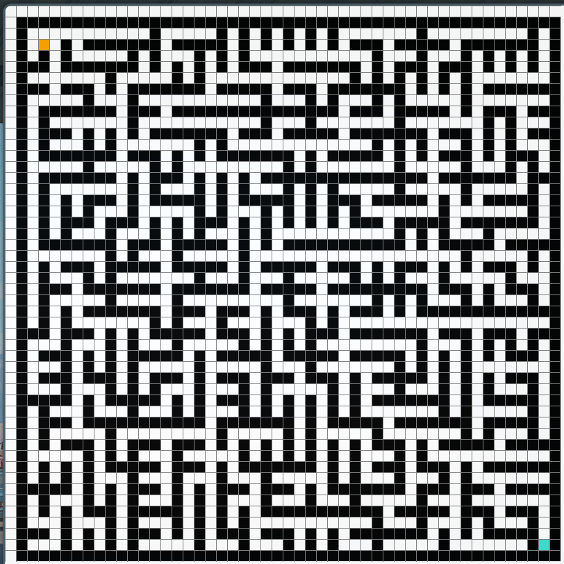
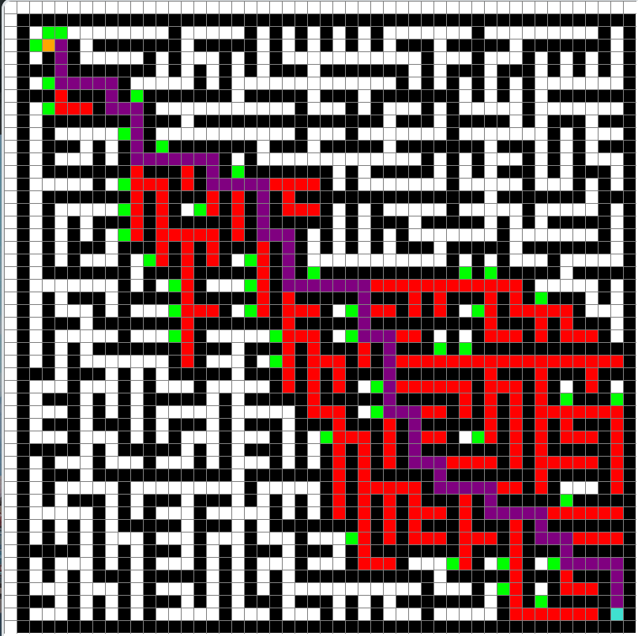

# A* Pathfinding Algorithm Visualizer

This project is a Python implementation of the A* pathfinding algorithm, visualized using the Pygame library. It provides a simple and interactive way to understand how the A* algorithm works.

This project demonstrates the A* pathfinding algorithm in action. Below are examples of a generated maze before and after the algorithm finds a path.

### Unsolved Maze
A randomly generated maze with a start (orange) and end (turquoise) point. Obstacles are black.


### Solved Maze
The same maze after the A* algorithm has found the shortest path. The path is highlighted in purple, and explored nodes are shown in red and green.


## Features

*   **Interactive Grid:** Create and remove obstacles (walls) by clicking on the grid.
*   **Start and End Points:** Define the start and end points for the pathfinding algorithm.
*   **Real-time Visualization:** Watch the A* algorithm explore the grid in real-time.
*   **Path Reconstruction:** Once the destination is reached, the shortest path is highlighted.
*   **Maze Generation:** Automatically generate a random maze to test the algorithm.

## How to Use

1.  **Run the script:**
    ```bash
    python main.py
    ```

2.  **Set Start and End points:**
    *   The start (ORANGE) and end (TURQUOISE) points are already set.

3.  **Create Obstacles:**
    *   Click on any white cell to create a barrier (BLACK).

4.  **Start the Algorithm:**
    *   Press the **SPACEBAR** to start the A* pathfinding algorithm.

5.  **Reset the Grid:**
    *   Press the **'c'** key to clear the grid and reset the start/end points.

6.  **Generate a Maze:**
    *   Press the **'d'** key to generate a random maze.
    
7.  **Quit:**
    *   Press the **'q'** key to quit the program.

## Requirements

*   Python 3
*   Pygame

Install the necessary library using pip:
```bash
pip install pygame
```

## Algorithm

The A* algorithm is a popular and efficient pathfinding algorithm. It works by maintaining a priority queue of nodes to visit, prioritized by a heuristic function `f(n) = g(n) + h(n)`, where:

*   `g(n)` is the cost of the path from the start node to `n`.
*   `h(n)` is the estimated cost of the cheapest path from `n` to the goal (heuristic). In this implementation, the Manhattan distance is used as the heuristic.